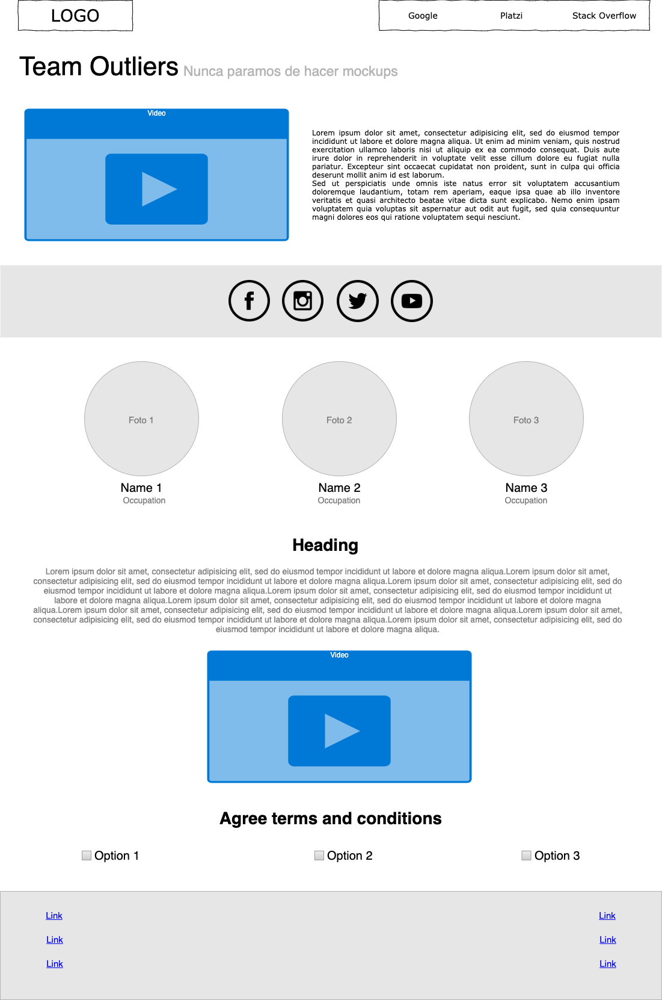
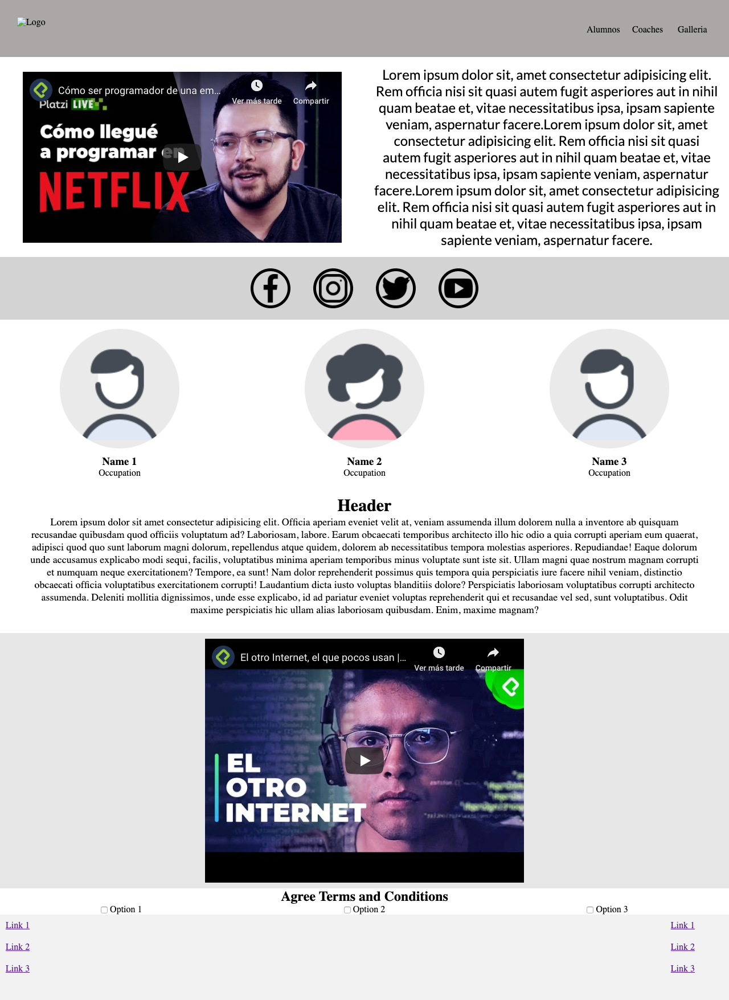

# maqueta-team

Maquetacion realizada por el Team Master

## Wireframe

En este proyecto, se creara en equipo el siguiente wireframe:

y este fue el resultado :)

Se crearon los siguientes componentes:

## Photo zone

This section shows the photo area which was created with HTML and css grid.

## Preview

This section was created by Guiselle Mejía

## Component video

This is the component video

### Description

This section show a video in the landing page
The file css [it's here](/style/css/video.ss)

### The result it's here

The mockup:

#### Developer: [dfloresdev](https://github.com/dfloresdev)

## Section video with text

This component works to put a video with a description
This component was create with HTML and CSS, This component is responsive. 

### View in Desktop 

### View in Mobile

### Mockup 

## Article

This component refers to the article of the page. The article is made with CSS and HTML.

### Technologies used

* CSS
* HTML

### View of the component on the page

### Author

**Juan Camilo Rico Orjuela**  <juancarico92@gmail.com>

# Checkbox Container

The checkbox container has 3 checkboxes with different options.

The wireframe:

It looks like this:

Tecnologies used:

- HTML
- CSS

Follow me [@AryRosvall](https://twitter.com/AryRosvall)

